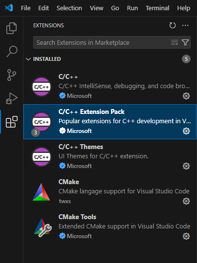
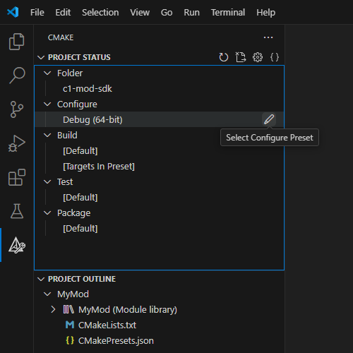
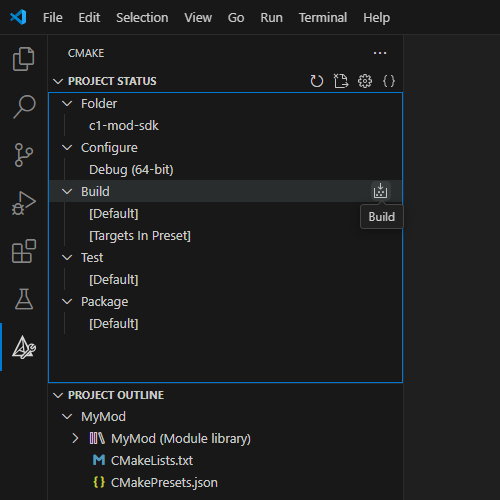
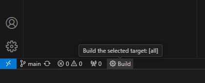
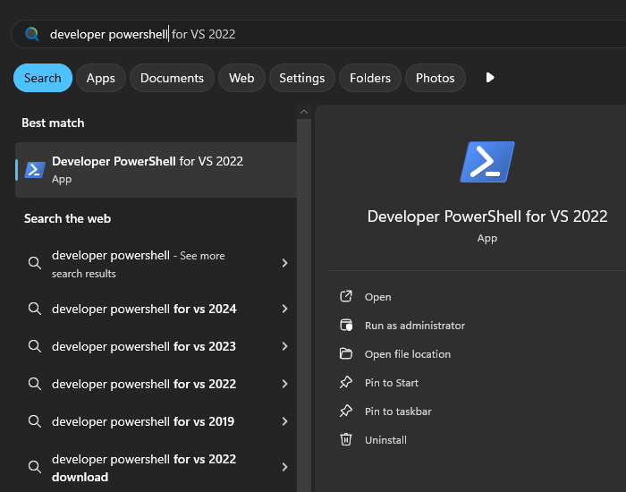
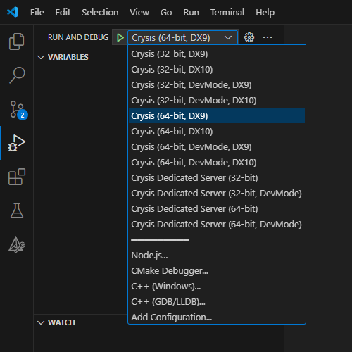

# Crysis Mod SDK

Create your own Mod DLL for [Crysis (2007)](https://en.wikipedia.org/wiki/Crysis_(video_game)) using modern tools.

## Getting started

You will need a computer **that can run Crysis** with Windows 10 or later.

Older versions of Windows are also fine as long as they run the tools mentioned below.
Linux can also be used, but it requires a special setup (Wine + DXVK + MSVC in Wine), which is not described here.

### Install Crysis (2007)

Ideally from [GOG](https://www.gog.com/game/crysis), but [Steam](https://store.steampowered.com/app/17300/Crysis/)
and [EA](https://www.ea.com/games/crysis/crysis) are fine too.

DVD version can also be used, but then you need to install [1.2](https://comrade.one/Crysis_Patch_1_2.exe) and
[1.2.1](https://comrade.one/Crysis_Patch_1_2_1.exe) official patches.

> [!TIP]
> Replace the original Crysis executables with [C1-Launcher](https://github.com/ccomrade/c1-launcher).
> It provides various quality of life improvements and simply makes the game work.
>
> This is a recommended but optional step. If the original executables work on your computer, you can use them.

### Install Git

```powershell
winget install -e --id Git.Git
```

### Install MSVC toolchain and CMake

> [!NOTE]
> If you already have Visual Studio 2019 or later with **Desktop development with C++** workload installed,
> you can skip this step.

```powershell
winget install -e --id Microsoft.VisualStudio.2022.BuildTools --override "--wait --passive --includeRecommended --add Microsoft.VisualStudio.Workload.VCTools"
```

### Install Visual Studio Code (VS Code)

```powershell
winget install -e --id Microsoft.VisualStudioCode
```

After the installation, open VS Code, go to Extensions, and install **C/C++ Extension Pack** to get the following:



For more information, see the [official documentation](https://code.visualstudio.com/docs/cpp/config-msvc).

### Clone the repository

> [!IMPORTANT]
> The repository (project) folder should be placed in Crysis folder.
>
> For example: `C:\GOG Games\Crysis\c1-mod-sdk`

#### Using command line

Change into Crysis folder:

```powershell
cd "C:\GOG Games\Crysis"
```

And clone the repository:

```powershell
git clone "https://github.com/ccomrade/c1-mod-sdk.git"
```

#### Using VS Code

With no folder open, click Clone Repository, use this repository URL, and select Crysis folder as the destination.

#### Using GitHub.com

Just click **Code > Download ZIP** above and extract it into Crysis folder.
Note that Git is not needed this way, but it also means that no version control is available.

### Open the project

Open the folder created in the previous step in VS Code. That's it.

## Building

In CMake view, select the configuration you want to use:



And run the build:



Or use the status bar button:



### Building via command line

You can also run the build without VS Code. It requires MSVC toolchain command line:



Change into the project folder:

```powershell
cd "C:\GOG Games\Crysis\c1-mod-sdk"
```

Available configurations can be viewed using:

```powershell
cmake --list-presets
```

Prepare the selected configuration:

```powershell
cmake --preset release-bin64
```

Run the build:

```powershell
cmake --build ..\Mods\MyMod\Bin64
```

## Debugging

Go to Run and Debug view in VS Code, select what you want to debug, and launch it:



## Running

You can also run your mod without VS Code:

```powershell
..\Bin32\Crysis.exe -mod MyMod
```

Add `-dx9` or `-dx10` to run the game in DX9 or DX10 mode. By default, it runs in DX10 mode.

To run 64-bit version, use `Bin64` instead of `Bin32`.

To run a dedicated server, use `CrysisDedicatedServer.exe` instead of `Crysis.exe`.
